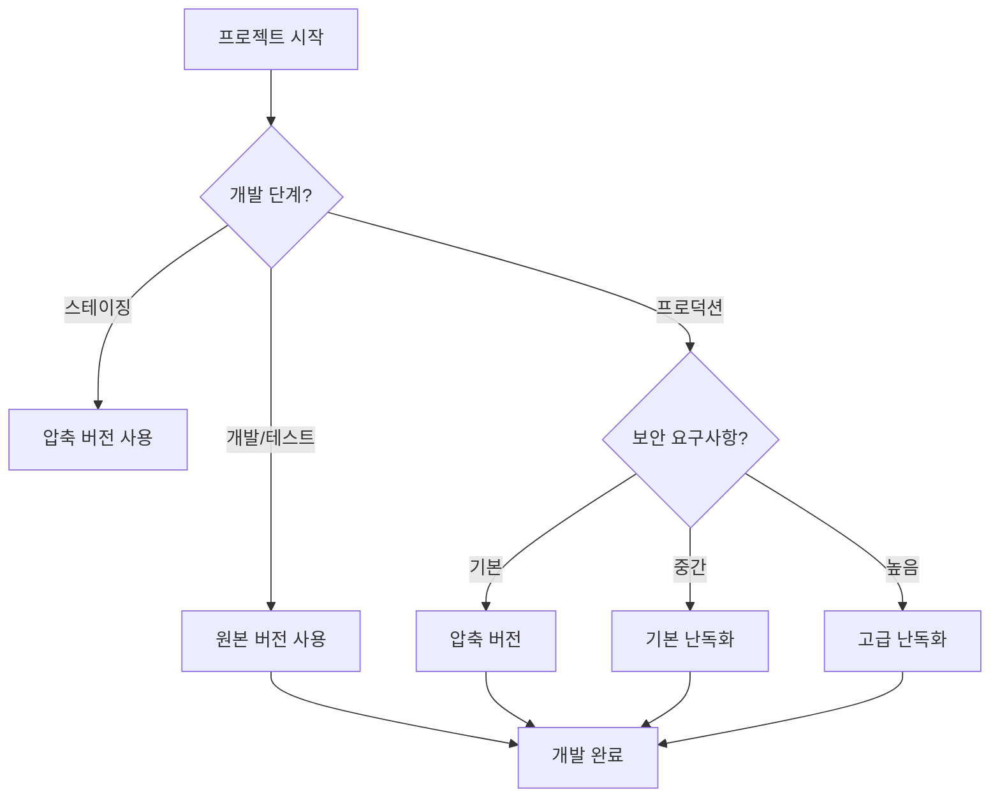

# 🔒 보안 및 난독화 가이드

ChatBot Popup Library는 다양한 보안 수준의 4가지 버전을 제공합니다. 각 버전은 서로 다른 용도와 보안 요구사항에 맞게 설계되었습니다.

## 🏷️ 버전별 보안 수준

### 1. 원본 버전 (chatbot-library.js)
**보안 수준: 🔓 낮음**

```html
<script src="https://cdn.jsdelivr.net/gh/gunggme/chatbot-popup@latest/lib/chatbot-library.js"></script>
```

**특징:**
- ✅ 읽기 쉬운 코드
- ✅ 주석과 문서화 포함
- ✅ 디버깅 용이
- ✅ 교육 및 학습 목적
- ❌ 코드 완전 노출
- ❌ 역공학 취약

**권장 용도:**
- 개발 및 디버깅
- 교육 및 학습
- 코드 검토
- 로컬 개발 환경

### 2. 압축 버전 (chatbot-library.min.js)
**보안 수준: 🔒 보통**

```html
<script src="https://cdn.jsdelivr.net/gh/gunggme/chatbot-popup@latest/lib/chatbot-library.min.js"></script>
```

**특징:**
- ✅ 파일 크기 최적화 (~15KB)
- ✅ 로딩 속도 향상
- ✅ 기본적인 변수명 단축
- ✅ 공백 및 주석 제거
- ⚠️ 기본적인 코드 보호
- ❌ 전문적인 역공학에 취약

**권장 용도:**
- 일반 프로덕션 환경
- 공개 웹사이트
- 빠른 로딩이 필요한 환경
- 기본적인 코드 보호가 필요한 경우

### 3. 기본 난독화 버전 (chatbot-library.obf.js)
**보안 수준: 🔐 높음**

```html
<script src="https://cdn.jsdelivr.net/gh/gunggme/chatbot-popup@latest/lib/chatbot-library.obf.js"></script>
```

**특징:**
- ✅ 변수명 및 함수명 암호화
- ✅ 문자열 배열화 및 인코딩
- ✅ 코드 흐름 복잡화
- ✅ 기본적인 역공학 방지
- ✅ 중간 수준의 코드 보호
- ⚠️ 파일 크기 증가 (~37KB)

**권장 용도:**
- 코드 보호가 필요한 상업용 환경
- IP 보호가 중요한 프로젝트
- 내부 비즈니스 로직 보호
- 경쟁사 분석 방지

### 4. 고급 난독화 버전 (chatbot-library.secure.js)
**보안 수준: 🛡️ 최고**

```html
<script src="https://cdn.jsdelivr.net/gh/gunggme/chatbot-popup@latest/lib/chatbot-library.secure.js"></script>
```

**특징:**
- ✅ **Self-Defending**: 개발자 도구 감지 및 차단
- ✅ **Debug Protection**: 디버깅 시도 방지
- ✅ **Control Flow Flattening**: 코드 흐름 완전 복잡화
- ✅ **Dead Code Injection**: 가짜 코드 삽입
- ✅ **String Array Encoding**: Base64 문자열 인코딩
- ✅ **Unicode Escape**: 유니코드 이스케이프
- ✅ **Variable Name Mangling**: 변수명 완전 암호화
- ⚠️ 파일 크기 대폭 증가 (~168KB)
- ⚠️ 디버깅 불가능

**권장 용도:**
- 최고 수준의 보안이 필요한 환경
- 핵심 비즈니스 로직 보호
- 금융/의료 등 민감한 분야
- 고가치 소프트웨어 보호

## 🛡️ 고급 보안 기능 상세

### Self-Defending (자기 방어)
```javascript
// 개발자 도구 감지 시 코드 실행 중단
setInterval(function() {
    if (window.outerHeight - window.innerHeight > 200) {
        // 개발자 도구가 열렸을 때 실행되는 보호 코드
    }
}, 100);
```

### Debug Protection (디버깅 보호)
```javascript
// 디버깅 시도 시 무한 루프 생성
(function() {
    setInterval(function() {
        debugger;
    }, 100);
})();
```

### Control Flow Flattening (제어 흐름 평활화)
```javascript
// 원본 코드
function example() {
    if (condition) {
        doSomething();
    } else {
        doSomethingElse();
    }
}

// 난독화된 코드 (개념적 예시)
function example() {
    var _0x1234 = 0x0;
    while (true) {
        switch (_0x1234) {
            case 0x0:
                if (condition) _0x1234 = 0x1;
                else _0x1234 = 0x2;
                break;
            case 0x1:
                doSomething();
                return;
            case 0x2:
                doSomethingElse();
                return;
        }
    }
}
```

### Dead Code Injection (가짜 코드 삽입)
```javascript
// 실제 동작하지 않지만 분석을 어렵게 만드는 가짜 코드들이 삽입됨
function _0xfake1() { /* 가짜 함수 */ }
var _0xfake2 = "fake string";
// ... 수많은 가짜 코드들
```

## 📊 성능 비교

| 버전 | 파일 크기 | 로딩 시간* | 실행 속도 | 메모리 사용량 |
|------|-----------|------------|-----------|--------------|
| 원본 | ~22KB | 빠름 | 빠름 | 낮음 |
| 압축 | ~15KB | 매우 빠름 | 빠름 | 낮음 |
| 기본 난독화 | ~37KB | 보통 | 보통 | 보통 |
| 고급 난독화 | ~168KB | 느림 | 느림 | 높음 |

*3G 네트워크 기준

## 🎯 버전 선택 가이드

### 개발 단계별 권장사항



### 산업별 권장사항

#### 🏢 일반 기업 웹사이트
```html
<!-- 권장: 압축 버전 -->
<script src="lib/chatbot-library.min.js"></script>
```

#### 🏪 전자상거래
```html
<!-- 권장: 기본 난독화 -->
<script src="lib/chatbot-library.obf.js"></script>
```

#### 🏦 금융/의료
```html
<!-- 권장: 고급 난독화 -->
<script src="lib/chatbot-library.secure.js"></script>
```

#### 🎓 교육/연구
```html
<!-- 권장: 원본 버전 -->
<script src="lib/chatbot-library.js"></script>
```

## ⚠️ 주의사항 및 제한사항

### 고급 난독화 버전 사용 시 주의사항

1. **디버깅 불가능**
   - 개발자 도구가 차단됨
   - 콘솔 로그 출력 제한
   - 에러 메시지 난독화

2. **성능 영향**
   - 파일 크기 대폭 증가
   - 초기 로딩 시간 증가
   - 메모리 사용량 증가

3. **호환성 문제**
   - 일부 브라우저에서 과도한 리소스 사용
   - 모바일 기기에서 성능 저하 가능
   - 구형 브라우저 지원 제한

### 개발 환경 설정

```javascript
// 개발 환경에서는 항상 원본 버전 사용
if (process.env.NODE_ENV === 'development') {
    // 원본 버전 로드
    loadScript('chatbot-library.js');
} else if (process.env.NODE_ENV === 'production') {
    // 프로덕션 환경에 맞는 버전 선택
    if (highSecurityRequired) {
        loadScript('chatbot-library.secure.js');
    } else {
        loadScript('chatbot-library.min.js');
    }
}
```

## 🔧 커스텀 난독화 설정

고급 난독화 설정을 수정하려면 `obfuscator-config.json` 파일을 편집하세요:

```json
{
  "compact": true,
  "controlFlowFlattening": true,
  "controlFlowFlatteningThreshold": 0.8,
  "deadCodeInjection": true,
  "deadCodeInjectionThreshold": 0.5,
  "debugProtection": true,
  "debugProtectionInterval": 100,
  "disableConsoleOutput": true,
  "identifierNamesGenerator": "mangled-shuffled",
  "rotateStringArray": true,
  "selfDefending": true,
  "stringArray": true,
  "stringArrayThreshold": 0.8,
  "stringArrayEncoding": ["base64"],
  "stringArrayWrappersCount": 2,
  "stringArrayWrappersChainedCalls": true,
  "stringArrayWrappersType": "function",
  "transformObjectKeys": true,
  "unicodeEscapeSequence": true,
  "splitStrings": true,
  "splitStringsChunkLength": 5
}
```

### 설정 옵션 설명

| 옵션 | 설명 | 보안 수준 | 성능 영향 |
|------|------|-----------|-----------|
| `controlFlowFlattening` | 제어 흐름 복잡화 | 높음 | 높음 |
| `deadCodeInjection` | 가짜 코드 삽입 | 중간 | 중간 |
| `debugProtection` | 디버깅 방지 | 높음 | 중간 |
| `selfDefending` | 자기 방어 기능 | 매우 높음 | 낮음 |
| `stringArray` | 문자열 배열화 | 중간 | 중간 |
| `unicodeEscapeSequence` | 유니코드 이스케이프 | 낮음 | 낮음 |

## 🚀 빌드 및 배포

### 로컬 빌드

```bash
# 모든 버전 생성
npm run build:all

# 개별 버전 생성
npm run minify          # 압축 버전
npm run obfuscate       # 기본 난독화
npm run obfuscate:secure # 고급 난독화
```

### CI/CD 파이프라인

```yaml
# .github/workflows/build.yml
name: Build and Deploy
on:
  push:
    branches: [main]

jobs:
  build:
    runs-on: ubuntu-latest
    steps:
      - uses: actions/checkout@v2
      - name: Setup Node.js
        uses: actions/setup-node@v2
        with:
          node-version: '16'
      
      - name: Install dependencies
        run: npm install
      
      - name: Build all versions
        run: npm run build:all
      
      - name: Deploy to CDN
        run: |
          # CDN 배포 스크립트
```

## 📈 보안 모니터링

### 보안 이벤트 감지

고급 난독화 버전은 다음과 같은 보안 이벤트를 감지합니다:

1. **개발자 도구 열기 시도**
2. **콘솔 명령 실행 시도**
3. **디버깅 브레이크포인트 설정**
4. **소스 코드 추출 시도**

### 보안 로그

```javascript
// 보안 이벤트 발생 시 로그 (개념적 예시)
console.warn('Security Warning: Developer tools detected');
console.warn('Security Warning: Debugging attempt blocked');
console.warn('Security Warning: Console access restricted');
```

## 📞 보안 관련 문의

보안과 관련된 문의사항이나 취약점 신고는 다음으로 연락해 주세요:

- 📧 보안 이메일: security@example.com
- 🐛 GitHub Issues: [보안 라벨](https://github.com/gunggme/chatbot-popup/issues?q=label%3Asecurity)
- 🔒 비공개 보안 신고: security@gunggme.com

---

**⚠️ 면책 조항**: 난독화는 완벽한 보안을 보장하지 않습니다. 결정적인 리버스 엔지니어링을 완전히 방지할 수는 없으며, 중요한 비즈니스 로직은 서버 사이드에서 처리하는 것을 권장합니다. 